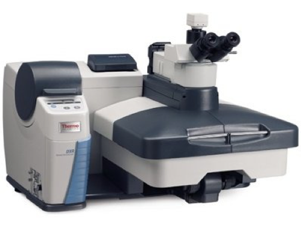
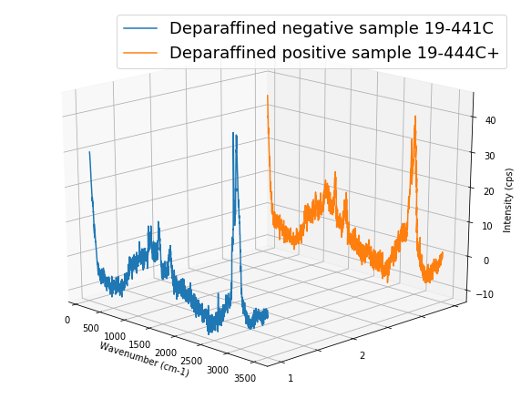

## What is Chronic Wasting Disease?
Chronic Wasting Disease (CWD) is a contagious neurological disease affecting deer, elk and moose. It causes a characteristic spongy degeneration of the brains of infected animals resulting in emaciation, abnormal behavior, loss of bodily functions and death.

CWD belongs to a group of diseases known as transmissible spongiform encephalopathies (TSEs). Within this family of diseases, there are several other variants that affect domestic animals: scrapie, which has been identified in domestic sheep and goats for more than 200 years, bovine spongiform encephalopathy (BSE) in cattle (also known as “mad cow disease”), and transmissible mink encephalopathy in farmed mink.

Several rare human diseases are also TSEs. Creutzfeldt-Jakob disease (CJD) occurs naturally in about one out of every one million people worldwide. Variant Creutzfeldt-Jakob disease (v-CJD) has been associated with the large-scale outbreak of BSE in cattle herds in Great Britain.

## Why are we concerned about Chronic Wasting Disease?
CWD poses serious problems for wildlife managers, and the implications for free-ranging deer and elk are significant:

* Ongoing surveillance programs are expensive and draw resources from other wildlife management needs.
* Impacts of CWD on population dynamics of deer and elk are presently unknown. Computer modeling suggests that CWD could substantially reduce infected cervid populations by lowering adult survival rates and destabilizing long-term population dynamics.
* Where it occurs, CWD may alter the management of wild deer and elk populations, and it has already begun to do so.
* Ultimately, public and agency concerns and perceptions about human health risks associated with all TSE’s may erode hunters confidence and their willingness to hunt in areas where CWD occurs.

## How do we study Chronic Wasting Disease in this project?
We propose to evaluate the effectiveness of Raman spectroscopy on skin biopsies from white-tailed deer infected with CWD. We collected Raman spectrum data of deparaffined samples, and compare the accuracy for different machine learning method, support vector machine and neural network.  

### Deparaffined Samples preparation
All of skin samples were from tail head. They were fixed in formaldehyde, rinsed with ethanol, embedded in paraffin, and put on gold slides finally. After we got gold slides with skin samples, we removed paraffine on samples to detect Raman spectrum. 
To deparaffinize the slides, they have to undergo incubation in xylene followed by a descending alcohol series as follows: 
1. 10min incubation in Xylene
2. 10min incubation in 100% ethanol
3. 10min incubation in 95% ethanol
4. 10min incubation in 70% ethanol
5. 10min incubation in DI water. 

### Raman spectrum collection 
Device: DXR Raman Microscope 

* 20 sec exposure time with 5 sample exposures
* 10x 0.25 BD microscope objective

Raman Spectra

All raman spectra was collected like image below.

[Plot Raman spectrum python notebook]( )

### Raman spectrum Data Analysis

#### Raw Data

You can download all Raman spectral data from this [zip file](https://github.com/juliachu216/ABE-516X-Project/blob/master/Raw%20Data.zip)

#### Pre-processing

1. Combine negative and positive data separately - Columns are wavelength value. Rows are different samples.
  
2. Smooth by moving average method - Define a smooth function
  
3. Baseline Correction by polynomial fitting method - Define a baseline correction function

[Pre-processing python notebook in Jupyter](https://nbviewer.jupyter.org/github/juliachu216/ABE-516X-Project/blob/master/analysis/Pre-process%20data.ipynb)

The final data frame is 520 rows × 1557 columns. The first 280 rows are negative signed as N, and the rest are positive signed as P.

#### Classification
1. Principal Component Analysis - Reduce the variable to 10 components.

2. Support Vector Machine - Use GridSearchCV to find the best parameters in suport vector machine.

3. Neural Network - Create a neural network model with 9 hidden layers, and the output layer is 2 classes (binary classification, 0 or 1). 

[Classification python notebook in Jupyter](https://nbviewer.jupyter.org/github/juliachu216/ABE-516X-Project/blob/master/analysis/Classification.ipynb)

### Communciate and visualize the results

What did you learn and do the results make sense?  Revisit your initial question and answer it. 

